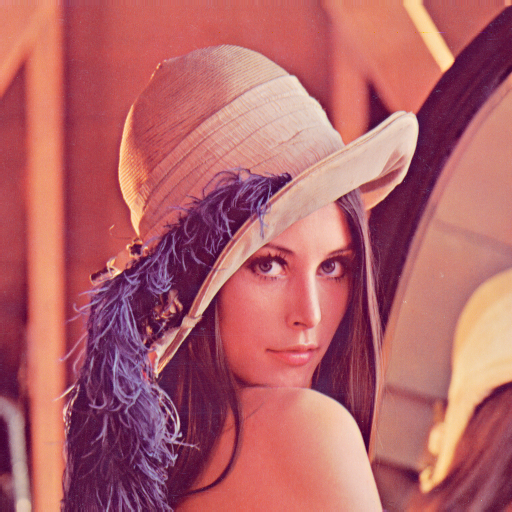
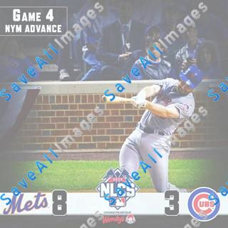

    # Since the RGB isn't perceptually uniform, I convert all the color representation into the LAB color space
    # which is supposed to be perfectually uniform. The difference in color is measured by Euclidean distance
    # between difference colors' LAB vector. The 'best match' is means the color with smallest difference from
    # the target. 
    
    # The computation part is effectively a (1-)nearest neighbour search in 3-dimensional space. I use a KDTree
    # for it.
    
    using Distances
    using KDTrees
    using Colors
    using ImageView
    using Images
    using Base.Test

    cd("images")
    
    function labRead(file)
      img = imread(file)
      imglab = convert(Image{Lab}, float32(img))
      return imglab
    end

    chdir images: no such file or directory (ENOENT)
    while loading In[18], in expression starting on line 1

    

     in cd at /Applications/Juno.app/Contents/Resources/app/julia/lib/julia/sys.dylib

    function colorAverage(Image)
      l = mean([pixel.l for pixel in Image])
      a = mean([pixel.a for pixel in Image])
      b = mean([pixel.b for pixel in Image])
      Lab{Float32}(l, a, b)
    end
    
    function extractVal(color::Lab)
      return [float64(color.l), float64(color.a), float64(color.b)]
    end
    
    function mosaic_color_mathcer(target, source)
      avgColor = reduce(hcat,map(x -> extractVal(colorAverage(labRead(x))), source))
      tree = KDTree(avgColor)
      id = knn(tree, target, 1)[1][1]
      return labRead(source[id])
    end

    mosaic_color_mathcer (generic function with 1 method)

    source = readdir()[2:end];
    # the folder contains 125 random baseball pictures and the Lena image

    labRead("lenna.png")

    LenaAvg = extractVal(colorAverage(labRead("lenna.png")))

    3-element Array{Float64,1}:
     51.5522
     33.3108
     11.3995

    mosaic_color_mathcer(LenaAvg, source)
    # the function finds the original Lena image by finding the nearest average color

    source = readdir()[2:end]
    labRead(source[16])

    Avg16 = extractVal(colorAverage(labRead(source[16])))
    mosaic_color_mathcer(Avg16, source)
    # random baseball picture is also found by finding closest average color

    # Rigorous testing:
    
    for file in source
      @test labRead(file) == mosaic_color_mathcer(extractVal(colorAverage(labRead(file))), source)
    end
    # It recovers all files based on its average color

    
